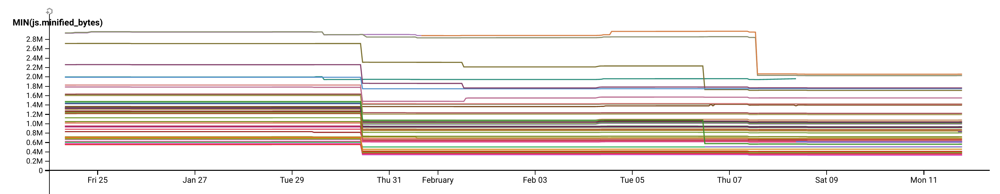
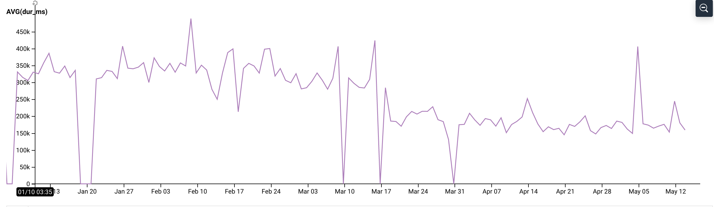
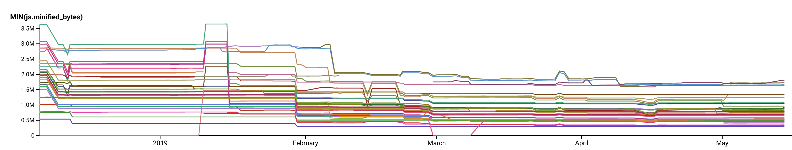

When I joined CarGurus last July, I didn't really understand the scale at which the UI builds work. Our company has been around since 2007, and over a decade of continuous development has build out a huge amount of infrastructure. The path to IPO was not entirely kind on the codebase, and the JavaScript community moves at a pace unlike others. On my first few weeks my jaw kinda dropped when I realized we have over 100 JavaScript bundles, and an average compile time of 20 minutes.

> The simple fact is our builds were slow, but so was our user experience

## Measuring

The first thing we did was to start measuring our bundles. We use [honeycomb](https://www.honeycomb.io) to ingest data over time. In our case, we started recording build times, and bundle sizes with some very simple webpack plugins. This allowed us to measure how large our bundles were over time.

## Duplicate dependencies

One of our big problems was duplicate dependencies, both inside 1 singular bundle, but also 1 singular page. We used some techniques [I've previously blogged about](https://blog.terrible.dev/Visualizing-your-javascript-bundle/), to understand what is in our bundle. 

We noticed a single bundle contained multiple copies of the same dependency. This is due to how npm resolves dependencies. Essentially if an application depends on react 16.6, but a library has a hard dependency on react 16.8 you could have 2 copies of react. In our case, we had created libraries with pinned dependencies. To put it another way, our libraries were not permissive about which versions of react they required. So our applications would end up with multiple copies of dependencies. This caused many bundles to be twice the size they should be. Hurting users, and developer productivity alike. We fixed this by making sure our libraries had [carets](https://stackoverflow.com/a/22345808/3671357) in-front of their version numbers. This tells npm that any minor, or patch can be used.

## DLL's

We started looking at the pages themselves. Like it or not, we have a few pages with multiple JavaScript bundles on the page. Some of those have dependencies on things like react. On a singular page we found 7 copies of react. This is bad for our builds, because we're compiling and packaging the same dependency so many times. However on-top of that our users had to download that very same dependency 7 times. 

Webpack has a plugin called the [DLL plugin](https://webpack.js.org/plugins/dll-plugin/) this plugin is designed to allow a common dependency to be in a single file. In our case, almost all our bundles had a copy of react, many had jquery, and quite a few had a large library called High Charts. We DLL'd the most common dependencies, which cut our compile time from 25 minutes to 15. We also saw huge reductions in page size. Shaving over 1mb on some of our older pages. This also improves users that come back to our site, as now they get cache hits on react, and other dependencies we don't change often.

## Cheap source maps

One thing we've found is we have a lot of code. Many packages do not get active development day to day. However, developers were paying the cost of compiling all that code. One thing we found is having `source-maps` turned on almost doubled the time it took for much of our codebase to compile. Switching over to `cheap-eval-source-map` cut our build times down from 15 minutes to 7 minutes. 

## Incremental Builds

We use yarn workspaces, and whats known as a `mono-repo`. Essentially our entire codebase is in one git repo, divided into npm packages that all resolve in a single filesystem. In the past developers had to compile the entire codebase when changes were made. We created our own webpack plugin that detects which files have changed any only recompile the bundles specific to what has changed. Our plugin is a lot like the [Hard Source](https://github.com/mzgoddard/hard-source-webpack-plugin) plugin, which you can use to do the same thing. By detecting what has changed, and only recompiling the changed files, we cut many of our builds from 7+ minutes to 30 seconds.

## Other Improvements

We also got some wins with:

* Using [thread loader](https://webpack.js.org/loaders/thread-loader/) to multi-thread our babel compiles
* Prevent the `node_modules` directory from being processed in babel
* Upgrading to babel 7
* Upgrading to webpack 4
* Setting [uglify's parallel flag](https://webpack.js.org/plugins/uglifyjs-webpack-plugin/)
* Setting the site up with a standard polyfill set
* Turning off split chunks in development mode
* Turn off PostCSS in dev

## Things you can use (but we can't)

We've got a bunch of babel and webpack plugins which prevent us from using these things. However, you may have some luck with them.

* Turn on babel disk caching in the [babel loader](https://github.com/babel/babel-loader)
  * This would net us 5 minutes back on clean builds, but we've got some plugins to rewrite
* Stop using `MiniCssExtractPlugin` in dev
* Turn off `ModuleContatinationPlugin` in dev
* Create a separate [runtime chunk](https://webpack.js.org/configuration/optimization/#optimizationruntimechunk)
* Use [webpack's cache loader](https://webpack.js.org/loaders/cache-loader) for CSS transforms

## Results

 

Developers are happy ✅

## Tools

* [Webpack duplicate package checker](https://github.com/darrenscerri/duplicate-package-checker-webpack-plugin)
* [Source Map Explorer](https://github.com/danvk/source-map-explorer)
* [Speed Measure Webpack Plugin](https://www.npmjs.com/package/speed-measure-webpack-plugin)